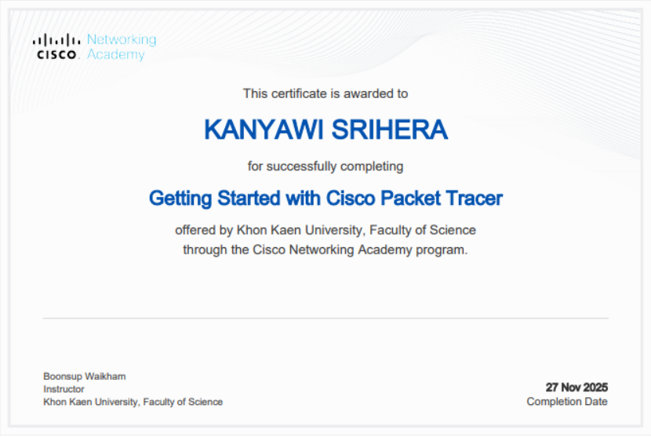
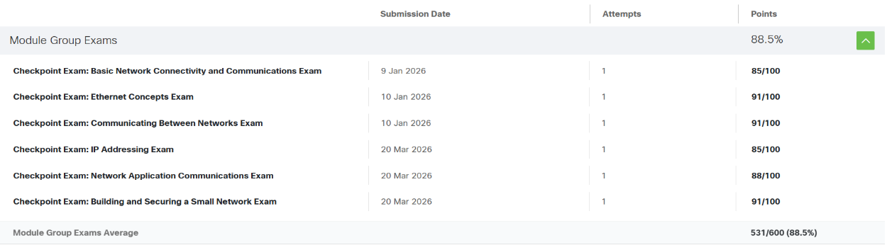
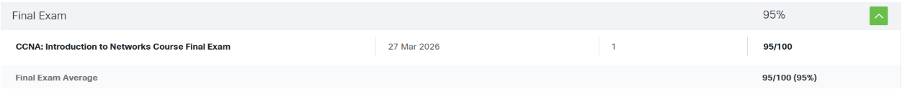

# 🌐 Computer Networks Portfolio

## 👩‍💻 About Me

* **ชื่อ:** นางสาวกัญญาวี ศรีเหรา
* **ชื่อเล่น:** ใบตอง
* **รหัสนักศึกษา:** 673380026-6
* **คณะ:** วิทยาลัยการคอมพิวเตอร์
* **สาขา:** วิทยาการคอมพิวเตอร์

---

## 💡 Reflection

จากการเรียนทำให้ฉันเข้าใจการทำงานของเครือข่ายตั้งแต่ระดับพื้นฐาน เช่น
**ARP, ICMP และ IP Address** ไปจนถึงระดับที่ซับซ้อน เช่น
**VLAN, NAT, Routing และ Microservices**

ฉันได้เรียนรู้ทั้งทฤษฎีและปฏิบัติ ทำให้สามารถ:

* วิเคราะห์ปัญหาเครือข่าย
* แก้ไขปัญหาได้จริง
* ออกแบบระบบในอนาคต เช่น **Spacetime Networking**

---

## 📘 Portfolio Summary

Portfolio นี้แสดงการเรียนรู้ด้าน **Computer Networks** ตั้งแต่พื้นฐานถึงขั้นสูง

ครอบคลุม:

* การออกแบบเครือข่าย
* การตั้งค่า Router / Switch
* การวิเคราะห์ระบบ
* การใช้งานจริง เช่น **NAT, WAN, Microservices**

---

## 🔗 Network Programming Workshops

👉 https://github.com/pudding0102/Network-Programming-Workshops.git

---

## 🏆 Certificates & Achievements

---

## 📚 Assignments

### 📝 Assignment 1: Personal Essay

🔗 Link:[Assignment 1](https://docs.google.com/document/d/1sNhmyDTZ_xA3vi8ZEAsm1jAWmmjc3_euk3RgJ5G9Zmg/edit?usp=sharing)

---

### 🌍 Assignment 2: Network Topologies

🔗 Link:[Assignment 2](https://docs.google.com/document/d/1UdEupC-gJLWBHQQtnam5F95Xkv2QVnWtrQpVvbLygds/edit?usp=sharing)

#### 🔹 Point-to-Point

* PC0: 192.168.0.1
* PC1: 192.168.0.2

#### 🔹 LAN (Star Topology)

* PC2: 192.168.0.1
* PC3: 192.168.0.2
* PC4: 192.168.0.3

#### 🔹 Two LANs with Router

* LAN1: 192.168.10.0/24
* LAN2: 192.168.20.0/24
* Gateway:

  * 192.168.10.1
  * 192.168.20.1

---

### 🔧 Assignment 3

🔗 Link:[Assignment 3](https://drive.google.com/file/d/1E-vvnxMtr4sbrj1ZSgfeW38e9hrhyj34/view)

**Overview:**
ทดลองการเชื่อมต่อผ่าน Switch และ Router

**Result:**

* สื่อสารใน LAN ได้
* สื่อสารข้ามเครือข่ายได้ผ่าน Router

---

### 🌐 Assignment 4: TCP & UDP

🔗 Link:[Assignment 4](https://docs.google.com/document/d/1kXBol9HC5WtbfWqwC6j7V8C42Beh6fuErNQbbDWCmFk/edit?usp=sharing)

**TCP (Reliable):**

* HTTP (80), FTP (21), Email

**UDP (Fast):**

* DNS (53)

---

## 🧪 Labs

### 🔹 Lab 1: Basic Network

🔗 Link:[Lab 1](https://docs.google.com/document/d/11k4OGAFt3NUgt-DRzoUeIaqRtW3ZguY-RExw4nCjCNQ/edit?usp=sharing)

* ศึกษา ARP, ICMP
* ทดสอบ ping สำเร็จ

---

### 🔹 Lab 2: VLAN & Router-on-a-Stick

🔗 Link:[Lab 2](https://docs.google.com/document/d/1dMqiBN2k61Y1nLfXnihVHNPONVrl6i2MZSwS6z4F4qY/edit?usp=sharing)

* VLAN 10 / 20 / 99
* ใช้ 802.1Q
* Inter-VLAN Routing

---

### 🔹 Lab 3: MIME & Packet Analysis

🔗 Link:[Lab 3](https://docs.google.com/document/d/14zPgMoRsEfh0FR6wB3qCvlQg8B4roqL_ugb6Qw2CDko/edit?usp=sharing)

* ใช้ TCP + Wireshark
* วิเคราะห์ Packet จริง

---

### 🔹 Lab 4: NAT & Internet Simulation

🔗 Link:[Lab 4](https://docs.google.com/document/u/0/d/1NJnRJEsZ7ckoM6w7Vkn80CA0OOFWpjfKEOCZHGylDng/edit)

* NAT Overload (PAT)
* Stateful vs Stateless

---

### 🔹 Lab 5: WAN & Microservices

🔗 Link:[Lab 5](https://docs.google.com/document/d/1vEmWyvEqgFgjgXXdpTUDHExy72YxGuNvlBE9xigtt2s/edit?usp=sharing)

* Internet Edge
* ISP WAN
* Microservices

---

## 🌍 Computer Networks in Daily Life

เครือข่ายมีบทบาทในชีวิตประจำวัน เช่น:

* การใช้สมาร์ตโฟน
* การสื่อสารออนไลน์
* แผนที่และการเดินทาง
* ความบันเทิง

---

## 🚀 Future Concept: Spacetime Networking

แนวคิดเครือข่ายอนาคตที่:

* ลดข้อจำกัดด้านเวลาและระยะทาง
* รองรับสภาพแวดล้อมซับซ้อน (อวกาศ / ใต้น้ำ / Virtual World)
* รองรับการสื่อสารระดับอนาคต

🔗 รายละเอียดเพิ่มเติม:[Link](https://docs.google.com/document/d/10GTCn2C3_dVl86nlCMyPH1Loigb-Wp-rKgcEauF4hz4/edit?usp=sharing)

---

## 🎓 Final Project

* 📁 Drive:[Link](https://drive.google.com/drive/folders/1pMTUDmsCbXrMSmXztLz72NXbjaL6pmo5?usp=sharing)
* 💻 GitHub:[Link](https://github.com/sarochaza/Spacing_NetworkVer1	)
* 🎥 Video1:[Link](https://youtu.be/Dx_VcjQMkpg)
* 🎥 Video2:[Link](https://youtu.be/-sHY4TGi8JE)
* 🤖 NotebookLM:[Link](https://notebooklm.google.com/notebook/7774228d-022b-458f-aaa6-32f92f9b285c)

---

## 📝 Exams

### 📌 Checkpoint Exam

### 📌 Final Exam

---

⭐ **Thank you for visiting my portfolio!**
